# Clawd

A desktop pet that lives on your screen and reacts to what you're doing. Built with Tauri v2 + Rust + native Win32 APIs. Ships as a single ~6MB `.exe`.

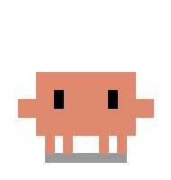

## Poses

<p>

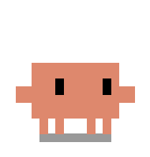
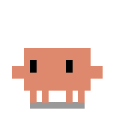
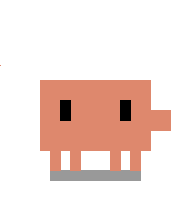
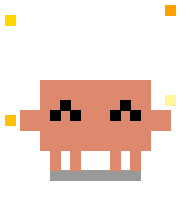
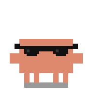
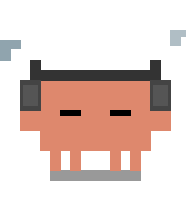
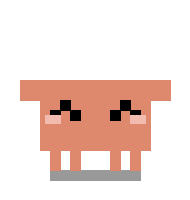
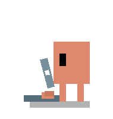
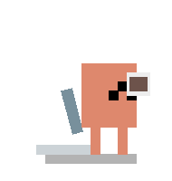
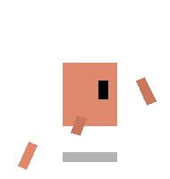
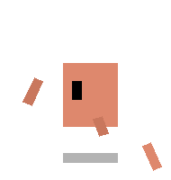
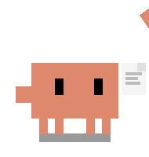
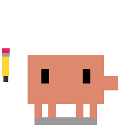
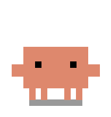
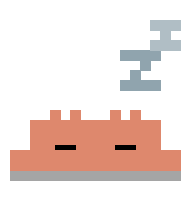
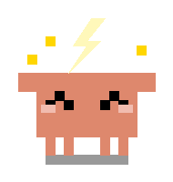
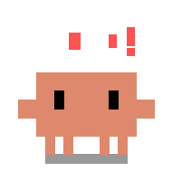
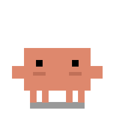
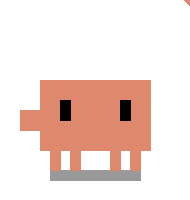
</p>

## What it does

Clawd sits in the corner of your screen and watches. It knows when you're coding, what music you're playing, and whether you remembered to plug in your laptop.

**Modes:**
- **Action** — Claude (CLI or desktop) is focused. Clawd types along, takes coffee breaks, and stretches after long sessions
- **Awake** — Claude is running but not focused. Clawd idles, looks around, does the thug life bit, and occasionally goes for a walk
- **Asleep** — No Claude running. Clawd dozes off after a drowsy transition

**Reactions:**
| Trigger | What happens |
|---------|-------------|
| Click Clawd | Happy bounce (opens Claude if it's not running) |
| Ctrl+C | Grabs the clipboard |
| Ctrl+V | Drops the clipboard |
| PrtSc / Win+Shift+S | Cheese pose |
| Plug in charger | Charging celebration |
| Spotify playing | Vibes to the music |
| Late night (11pm–5am) | Sleepy eyes |
| Low battery (≤20%) | Worried look |
| Ignored for 2 min | Tries to get your attention, gives up |

**Other behaviors:**
- Eye tracking follows your cursor
- Walks around the screen when idle for a while
- Draggable — pick it up and place it anywhere
- Token usage panel (click the stats icon) — reads from `~/.claude/projects/` JSONL files
- Instance badge shows when multiple Claude sessions are running

## Install

### Download
Grab `Clawd_3.0.0_x64-setup.exe` from [Releases](../../releases) and run it. That's it.

### Build from source

Requires [Rust](https://rustup.rs) and the Tauri CLI:

```bash
cargo install tauri-cli
cargo tauri build
```

The binary lands at `src-tauri/target/release/clawd.exe`. An NSIS installer is generated at `src-tauri/target/release/bundle/nsis/`.

## Configuration

`clawd.config.json` sits next to the executable. Every timing value, animation duration, and threshold is configurable — no recompilation needed.

<details>
<summary>Key settings</summary>

| Section | Key | Default | What it controls |
|---------|-----|---------|-----------------|
| `poll.systemState` | ms | `2500` | How often to check focused app, Spotify, battery |
| `poll.cursor` | ms | `33` | Cursor tracking rate (~30fps) |
| `poll.keypress` | ms | `80` | Hotkey detection rate |
| `idle.walkAfterCycles` | count | `8` | Idle cycles before walking becomes possible |
| `idle.walkChance` | 0–1 | `0.3` | Probability of walking each check |
| `coffee.interval` | ms | `18000` | Time between coffee breaks in action mode |
| `stretch.after` | ms | `1500000` | Continuous typing time before stretching (25 min) |
| `typing.speeds` | object | `0.12/0.085/0.055` | Typing animation speed for 1/2/3+ instances |
| `eyeTracking.range` | px | `3.5` | How far the eyes move |

</details>

## Architecture

```
clawd.exe (6MB)
├── Tauri v2 shell (WebView2)
├── Rust backend
│   ├── Cursor polling      — Win32 GetCursorPos + click-through toggle
│   ├── System state sensor — GetForegroundWindow, EnumWindows, CreateToolhelp32Snapshot
│   ├── Keypress sensor     — GetAsyncKeyState (Ctrl+C/V, PrtSc, Win+Shift+S)
│   └── Token stats reader  — walks ~/.claude/projects/ JSONL files
└── Frontend
    ├── SVG puppet rig      — composable skeleton with CSS animations
    ├── State machine        — manages mode transitions and animation locks
    └── renderer.js          — Tauri IPC bridge, drag/walk/idle/reaction logic
```

All system detection uses native Win32 API calls — no PowerShell, no Node.js, no child processes.

## Stats

| | Electron (v2) | Tauri (v3) |
|---|---|---|
| Binary size | ~180 MB | 6 MB |
| Memory usage | ~300 MB | ~34 MB |
| Installer | — | 1.5 MB |
| System detection | PowerShell scripts | Native Win32 API |

## License

MIT
